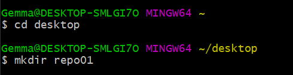
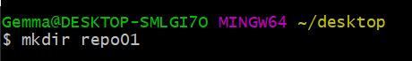
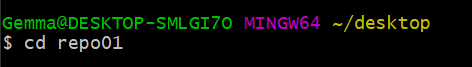

# **Ejercicios**
## Ejercicio 1

**Pasos para empezar**

* $ cd desktop :arrow_right: para abrir el directorio
  

* $ mkdir repo01 :arrow_right: para crear una nueva carpeta
 

* $ cd repo01 :arrow_right: para ir a la carpeta que acabamos de crear 

* $ code . :arrow_right: para abrir studio code

* $ git init :arrow_right: para iniciar los comandos en 

* $ git status :arrow_right: ver en que estado están los comando 

* $ git add . :arrow_right: añadir nuevos archivos creados

* $ git log :arrow_right: ver las entradas

* $ git remote -v :arrow_right: subir los archivos en github

## Todos los pasos seguidos

## Ejercicio 2  
